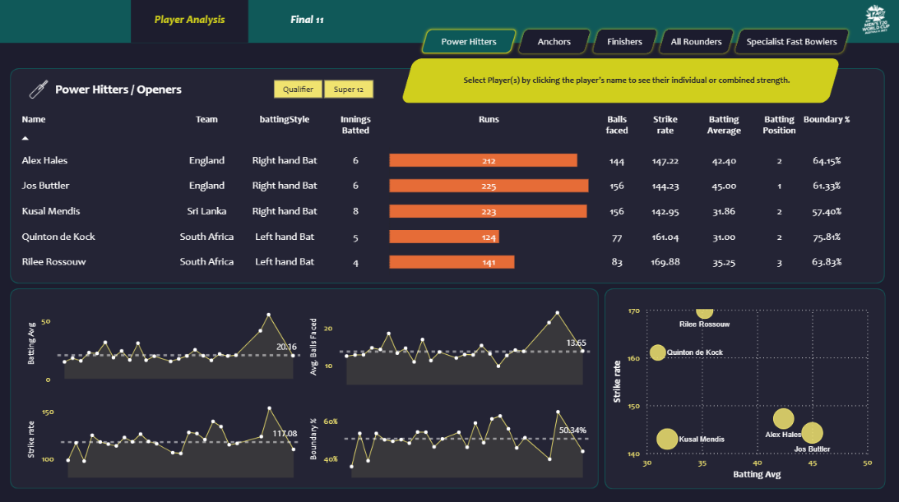
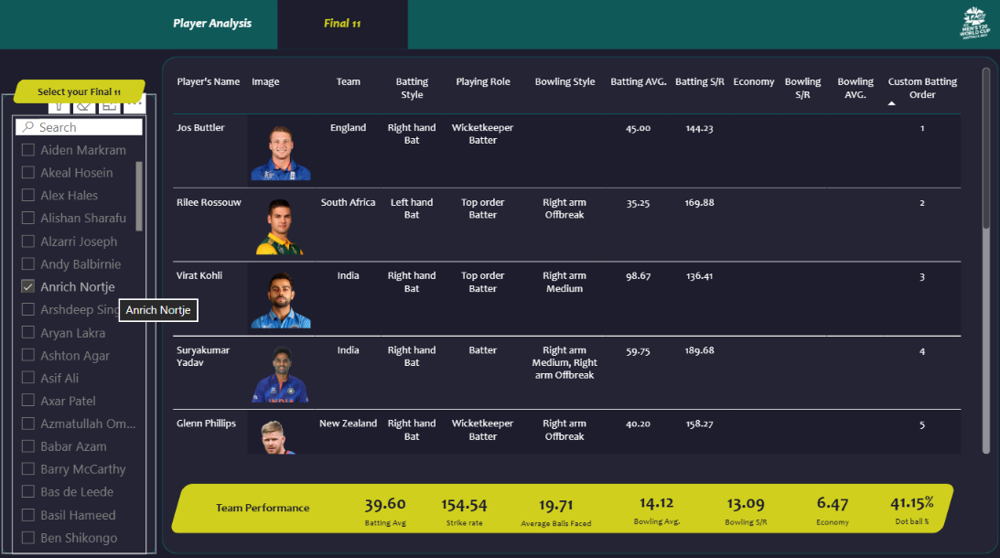

# 🏏 T20 Cricket Analytics | Power BI

An end-to-end **T20 Cricket Analytics** project built using **Python, Pandas, Power Query, DAX, and Power BI** to analyze player and team performance and generate data-driven insights.

---

## 📊 Project Overview

The **T20 Cricket Analytics** project transforms raw T20 cricket data into an interactive **Power BI dashboard**.

The project focuses on analyzing cricket performance data, comparing players and teams, identifying high-performing players, and supporting data-driven selection of a **T20 Best XI**.

The workflow covers data collection, data preprocessing, transformation, analysis, and visualization.

---

## 🎯 Project Objectives

- Analyze T20 cricket player performance.
- Evaluate batting and bowling performance.
- Compare players using performance metrics.
- Analyze team performance.
- Identify high-performing players.
- Select a data-driven T20 Best XI.
- Build interactive Power BI dashboards.
- Generate meaningful insights from cricket data.

---

## 🛠️ Tools & Technologies

- **Python** – Data collection and preprocessing
- **Pandas** – Data cleaning and manipulation
- **Power BI** – Interactive dashboard and data visualization
- **Power Query** – Data transformation and preparation
- **DAX** – Measures and calculated columns
- **Web Scraping** – Cricket data collection
- **GitHub** – Project documentation and version control

---

## 🔄 Project Workflow

```text
Data Collection
       ↓
Web Scraping
       ↓
Raw T20 Cricket Data
       ↓
Data Cleaning & Preprocessing
       ↓
Power Query Transformation
       ↓
Data Modeling
       ↓
DAX Measures & Calculated Columns
       ↓
Power BI Dashboard
       ↓
Performance Analysis
       ↓
Data-Driven Insights
```
---

## 📸 Dashboard Preview

### Player Analysis

The Player Analysis dashboard evaluates key batting metrics such as runs, strike rate, batting average, balls faced, and boundary percentage to compare player performance.



### Final 11 Selection

The Final 11 dashboard presents the selected players along with their roles and key batting and bowling performance metrics.


